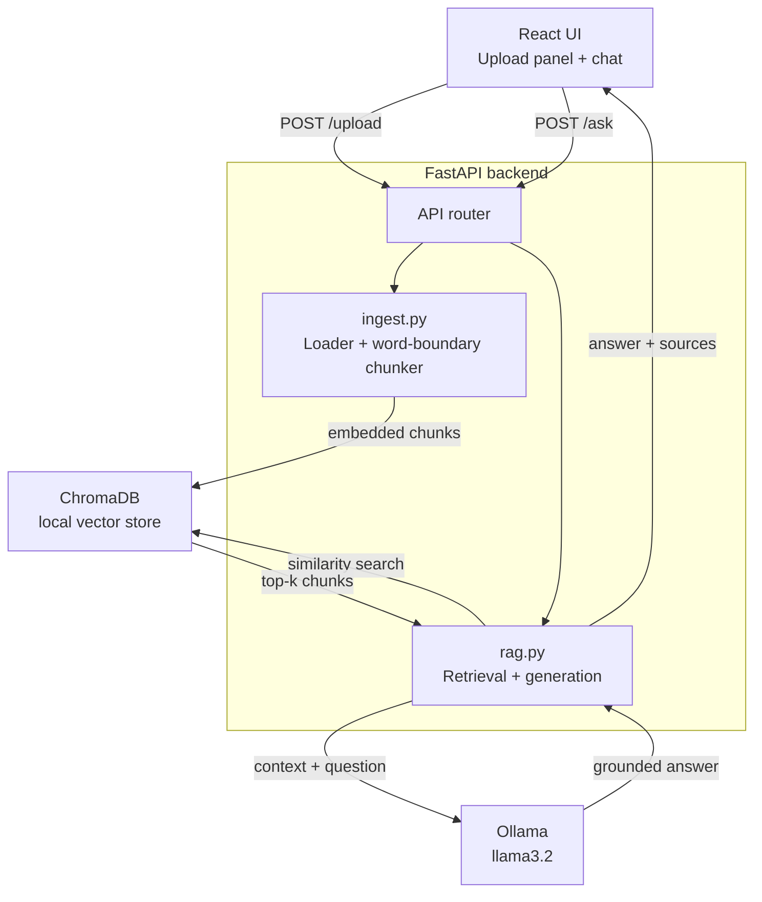

# Local RAG Document Q&A

Upload a document, ask questions about it, get answers grounded **only** in that document's content — with source citations, and an honest "I don't have enough information" when the answer isn't in there. Runs entirely on your own machine: no API keys, no per-request cost, no data leaving your laptop.


## Demo

<!-- Record a 30-60s screen capture: upload a doc, ask a question, show the cited answer -->
`[demo GIF goes here]`

## Stack

| Layer | Choice |
|---|---|
| LLM | Local [Ollama](https://ollama.com) (`llama3.2`) |
| Embeddings | Local HuggingFace sentence-transformers (`all-MiniLM-L6-v2`) |
| Vector store | ChromaDB (local, persistent) |
| Backend | FastAPI (Python 3.11) |
| Frontend | React + Vite, glassmorphic UI |

## Why this isn't just another RAG tutorial

- **Grounded, not guessing.** The system prompt forces the model to say "I don't have enough information" when the retrieved chunks don't answer the question — verified by a dedicated test, not just a hopeful prompt.
- **Word-aware chunking.** Splits on whitespace with configurable overlap, so no word gets cut in half mid-token the way naive character-count chunking does.
- **Tested core logic.** Chunking and the retrieval→generation pipeline are unit tested with fakes and mocks — 10 tests, run in milliseconds, no Ollama server or vector DB required to run them.
- **Zero cost, fully offline.** No API key, no cloud bill. A deliberate tradeoff against a larger hosted model's raw quality — one worth being able to explain, not hide.

## Architecture



**Flow:** a document is split into overlapping word-based chunks -> each chunk is embedded locally and stored in ChromaDB -> a question triggers a similarity search for the top-k relevant chunks -> those chunks are passed as context to a local Ollama model, instructed to answer only from that context and cite its sources.

## Project structure

```
rag-document-qa/
├── backend/
│   ├── app/
│   │   ├── main.py          # FastAPI routes: /upload, /ask, /health
│   │   ├── ingest.py        # document loading + word-boundary chunking
│   │   ├── vectorstore.py   # ChromaDB wrapper
│   │   ├── rag.py           # retrieval + local LLM generation
│   │   └── config.py        # env-based settings
│   ├── tests/
│   │   ├── test_ingest.py   # chunking logic — no external deps
│   │   └── test_rag.py      # RAG pipeline — mocked store & chat client
│   ├── requirements.txt
│   └── Dockerfile
├── frontend/
│   └── src/
│       ├── App.jsx
│       ├── index.css        # glassmorphic theme
│       └── components/      # ChatWindow, Message, UploadPanel
├── sample_docs/             # sample documents to test with
└── docker-compose.yml
```

## Running it locally

**1. Install Ollama and pull the model (one-time):**

```bash
ollama pull llama3.2
```

**2. Backend:**

```bash
cd backend
python -m venv .venv
source .venv/bin/activate        # Windows: .venv\Scripts\activate
pip install -r requirements.txt
cp .env.example .env             # defaults work as-is, no API key needed
uvicorn app.main:app --reload
```

Runs at `http://localhost:8000`. Interactive API docs at `http://localhost:8000/docs`.

**3. Frontend:**

```bash
cd frontend
npm install
npm run dev
```

Runs at `http://localhost:5173`, proxying `/api` to the backend.

**4. Try it:** upload a file from `sample_docs/`, then ask it a question whose answer is in there, and one whose answer isn't — confirm it admits the gap instead of guessing.

### Docker (backend + Ollama, fully self-contained)

```bash
docker compose up --build
docker exec -it rag-document-qa-ollama-1 ollama pull llama3.2
```

## Tests

```bash
cd backend
python -m unittest discover -s tests -v
```

10 tests, all passing, no Ollama server or vector database required — chunking tests use plain Python, and RAG pipeline tests inject a fake store and a mocked chat client, so the logic is verified without a network call.

## Design decisions (interview notes)

- **Why word-based chunking, not character-based?** Character splits can cut a word in half mid-token, hurting embedding quality. Splitting on whitespace keeps every chunk whole-word.
- **Why inject the chat client into `answer_question()` instead of constructing it inside?** Dependency injection — lets the RAG logic be tested with a fake client, no live Ollama server needed, tests run in milliseconds. It also means swapping in a hosted model later is a one-line change, not a rewrite.
- **Why local models instead of a hosted API?** Zero cost and fully offline, at the cost of a smaller model's lower ceiling than something like GPT-4 or Claude. Worth stating plainly, not glossing over.
- **Why ChromaDB?** Zero external setup — `PersistentClient` just writes to a local folder. `vectorstore.py` isolates it behind a small interface, so swapping in Pinecone or Qdrant later touches one file, not the whole app.

## Possible extensions

- Stream answers token-by-token instead of waiting for the full response
- Scope questions to a single uploaded document when multiple are indexed
- Add conversation memory so follow-ups resolve pronouns ("what about the second point?")
- Swap in a hosted model as a toggle, to compare answer quality against the local one

## License

MIT — see [LICENSE](LICENSE).
